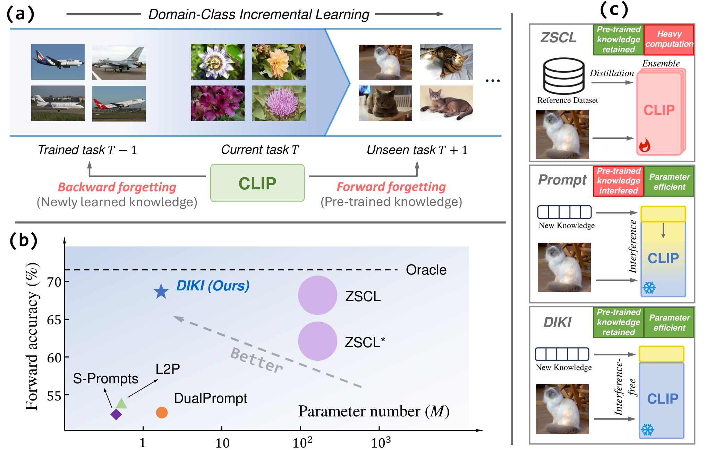

# [ECCV 2024] Mind the Interference: Retaining Pre-trained Knowledge in Parameter Efficient Continual Learning of Vision-Language Models

Official implementation of our ECCV 2024 paper [Mind the Interference: Retaining Pre-trained Knowledge in Parameter Efficient Continual Learning of Vision-Language Models](https://arxiv.org/abs/2407.05342).


## Introduction

**TL;DR**: We introduce a parameter-efficient method to retain pre-trained knowledge in VLMs during continual learning.

This study addresses the Domain-Class Incremental Learning problem, a realistic but challenging continual learning scenario where both the domain distribution and target classes vary across tasks. To handle these diverse tasks, pre-trained Vision-Language Models (VLMs) are introduced for their strong generalizability. However, this incurs a new problem: the knowledge encoded in the pre-trained VLMs may be disturbed when adapting to new tasks, compromising their inherent zero-shot ability. Existing methods tackle it by tuning VLMs with knowledge distillation on extra datasets, which demands heavy computation overhead. 
To address this problem efficiently, we propose the Distribution-aware Interference-free Knowledge Integration (DIKI) framework, retaining pre-trained knowledge of VLMs from a perspective of avoiding information interference. Specifically, we design a fully residual mechanism to infuse newly learned knowledge into a frozen backbone, while introducing minimal adverse impacts on pre-trained knowledge. Besides, this residual property enables our distribution-aware integration calibration scheme, explicitly controlling the information implantation process for test data from unseen distributions. Experiments demonstrate that our DIKI surpasses the current state-of-the-art approach using only 0.86% of the trained parameters and requiring substantially less training time.


*(a): The domain-class incremental learning setting, where the data distribution and the classes vary across all tasks. Two kinds of forgetting exist due to the integration of pre-trained CLIP. (b): The forward accuracy and the number of trainable parameters for each method, with the size of the markers representing their computational complexity. (c): Existing methods either demand heavy computation or sacrifice pre-trained knowledge. Our approach effectively retain pre-trained knowledge within a parameter-efficient framework.*


## Dataset preparations

Please refer to [dataset.md](docs/datasets.md).


## Installations

### Environment
First clone the repository:
```bash
git clone https://github.com/lloongx/DIKI.git
```

Then create an environment and install dependencies:
```bash
bash setup_environment.sh
``` 

### Models

For training, the CLIP model will be automatically downloaded.

For better reproduction, We also provide the post-training models of each training step on MTIL benchmark at [here](https://drive.google.com/drive/folders/1nHpyRUr7lmAwAx42k4iptd7tflcyM9RP?usp=sharing).


## Running

We provide three config files under `configs/`: `MTIL.yaml`, `MTIL-order-II.yaml` and `MTIL-FS.yaml`, representing three training protocols in our paper.

For example, to reproduce the results in Tab. 1, please run:

```bash
python main.py --config-path configs/MTIL.yaml
```


## Citation

```
@article{tang2024mind,
  title={Mind the Interference: Retaining Pre-trained Knowledge in Parameter Efficient Continual Learning of Vision-Language Models}, 
  author={Tang, Longxiang and Tian, Zhuotao and Li, Kai and He, Chunming and Zhou, Hantao and Zhao, Hengshuang and Li, Xiu and Jia, Jiaya},
  journal={arXiv preprint arXiv:2407.05342},
  year={2024}
}
```


## Contact
If you have any questions, please create an issue on this repository (preferred) or contact [Longxiang Tang](mailto:lloong.x@gmail.com).


## Acknowledgements

This code is initially based on [Continual-CLIP](https://github.com/vgthengane/Continual-CLIP), and some implementations are borrowed from [CoOp](https://github.com/KaiyangZhou/CoOp) and [ZSCL](https://github.com/Thunderbeee/ZSCL). We thank their authors for releasing their code.
